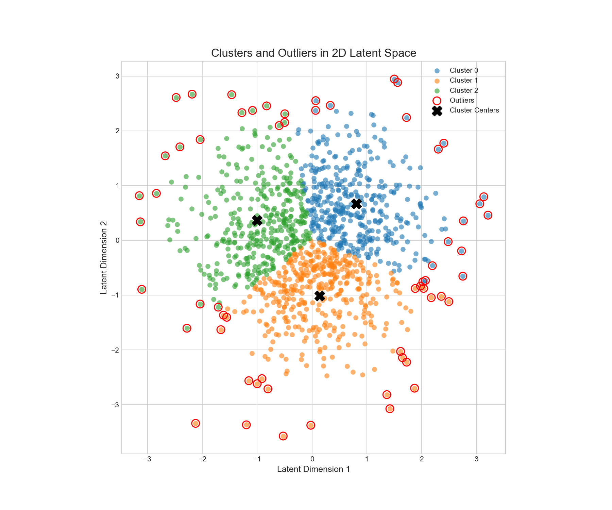

# Graph-Based Community Detection for Fraud Analytics

This repository contains code and results for a small project that applies graph-based community detection and VAE + K-Means analysis to identify outliers for fraud analytics. The primary script is `Code.py` and example outputs are provided in `vae_kmeans_outlier_results_v2/`.

## Repository structure

- `Code.py` - Main Python script to load data, build graph(s), run community detection, and perform VAE + K-Means outlier detection. See the header of the file for runtime flags and parameters.
- `data.csv` - Input dataset used by `Code.py`.
- `vae_kmeans_outlier_results_v2/` - Example outputs produced by the analysis. Contains:
  - `clusters_and_outliers_2d.png` - 2D visualization of clusters and flagged outliers.
  - `identified_outliers.csv` - CSV with identified outlier records and scores.
- `Report.pdf` - Project report describing methods, experiments, and results.

## Requirements

This project uses Python 3.8+ and common data/science libraries. Create a virtual environment and install dependencies before running.

Suggested minimal dependencies (create a `requirements.txt` or use pip to install):

- numpy
- pandas
- scikit-learn
- torch (if `Code.py` uses a VAE implementation requiring PyTorch)
- torchvision (optional, if used)
- networkx (for graph construction/analysis)
- python-louvain or community (for Louvain community detection) or `community-louvain`
- matplotlib
- seaborn

Install example:

```bash
python -m venv .venv
source .venv/bin/activate
pip install numpy pandas scikit-learn torch networkx python-louvain matplotlib seaborn
```

If `Code.py` has a `requirements.txt` in the repository, prefer using that:

```bash
pip install -r requirements.txt
```

## Usage

1. Ensure `data.csv` is present in the repository root or update `Code.py` to point to your data source.
2. Activate your virtual environment.
3. Run the main script:

```bash
python Code.py
```

4. Results will be saved under `vae_kmeans_outlier_results_v2/` (or the output directory specified inside `Code.py`). Check `identified_outliers.csv` for a table of flagged outliers and `clusters_and_outliers_2d.png` for a visualization.



## Reproducing results

- Open `Code.py` and review the top-level parameters (random seeds, model hyperparameters, file paths). Set any paths required.
- For deterministic runs, set random seeds in NumPy, PyTorch, and scikit-learn (if applicable).
- Run the script and compare outputs with files in `vae_kmeans_outlier_results_v2/`.